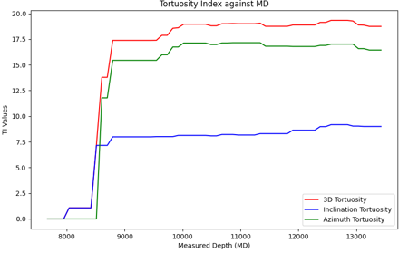
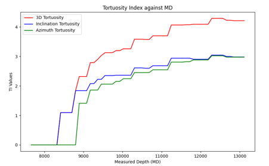
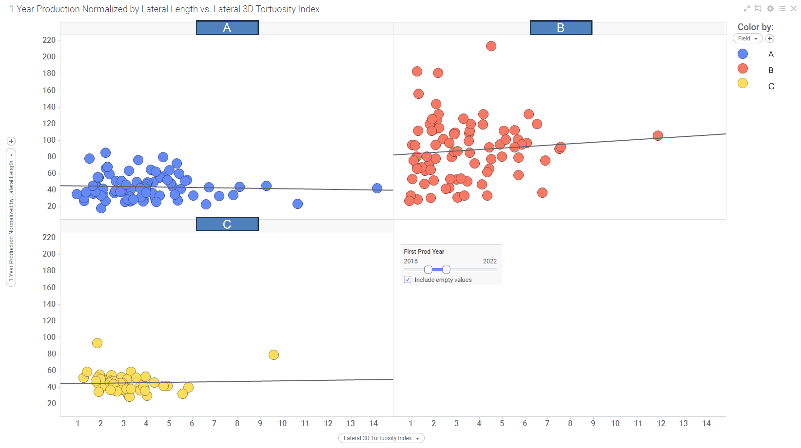
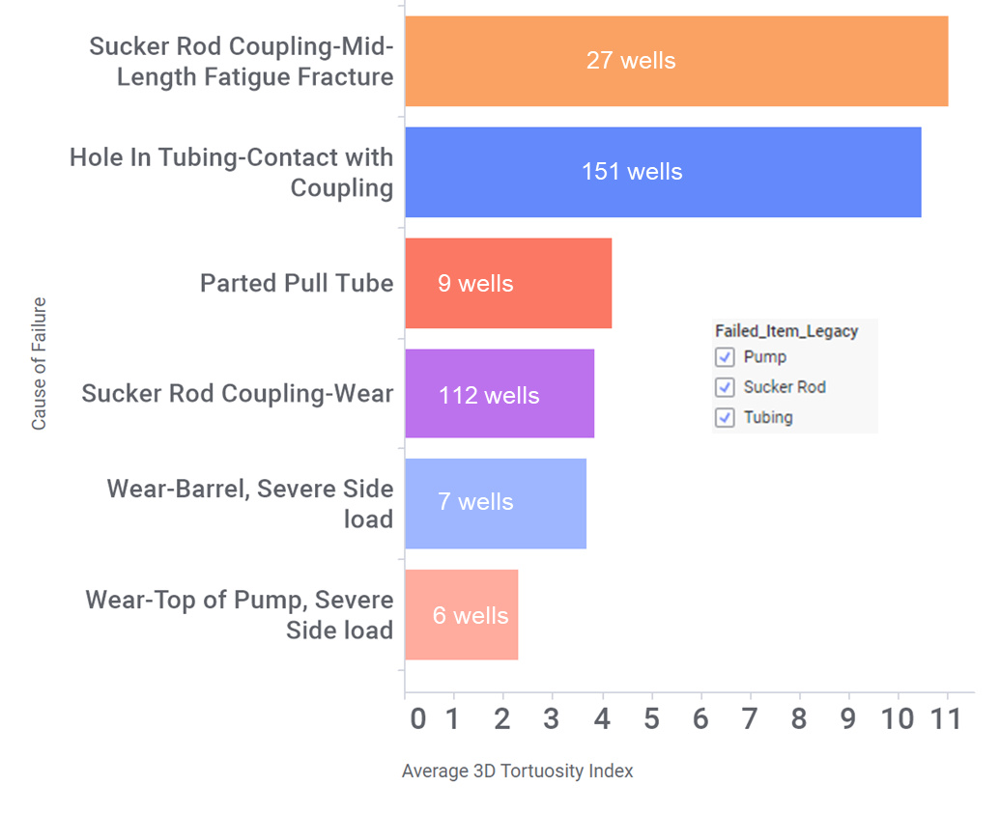

# Tortuosity-Index
## Overview
A customizable tool is developed to estimate 3D tortuosity index (TI) using survey data from directional drilling. 
Tortuosity index is estimated using a real-time 3D tortuosity index (https://doi.org/10.2118/178869-MS), originally developed to capture retinal blood-vessel micro-tortuosity. First the borehole trajectory is transformed into consecutive curve turns by finding inflection points. Inflection points are identified by tracking the curvature changes in inclination and azimuth direction. The number of curve turns, and amplitude of each turns contribute to the overall tortuosity index. Azimuth and inclination deviation are calculated separately and combined into one index for 3D estimation. 

To evaluate if wellbore deviation is responsible for downhole equipment failure, 3D TI of a special well that suffered from artificial lift system (ALS) tubing failure is estimated. TI was calculated using the utility tool developed in this study separately for the vertical and lateral section of the wellbore. It was observed that vertical section of that well was significantly more tortuous than the lateral section, which could be responsible for the ALS failure. The work is then extended to other wells that had ALS failure due to reasons likely related to borehole geometry. The most significant new finding is that certain ALS failure causes such as sucker rod coupling mid-length fatigue fracture and hole in tubing-contact with coupling were more strongly linked to wellbore deviation than the other causes. This insight allows the production engineer to optimize the ALS configurations and deployment techniques to better accommodate varying degrees of wellbore deviation. To evaluate if wellbore geometry has any association with production performance, lateral TI and first year production data of wells from three different fields with same target formation were analyzed. Findings revealed no association between TI and production performance, which is consistent with the findings from previous studies. 

The novelty of this work is the development of such a highly customizable tool that allows calculating the tortuosity index in any section of the wellbore. The source code of the tool is provided so that everyone can benefit from the work.
Besides, for the first time this study explored the effect of wellbore deviation on ALS equipment failure. This will allow the engineers prioritize preventive measures and mitigate risks effectively.

## Code Descriptions

### Tourtuosity_Functions
[Tortousity Functions](./Tortuosity_Functions.py) file has all the functions required to calculate TI. 
Just save this file and use it as a library. Import any functions from here to get desired result. 
This file is also used in backend to create the app. 

### Visualization_functions
[Visualization_functions](./Visualization_Functions.py) has the functions to get the directional drilling survey data by different means (e.g., by wellID, wellname, pad name, etc.)
The [GUI tool](./GUI.py) calls these functions backend to get the data, calculate TI, and make plots. Some functions are deliberately kept filtered to prevent unwanted access to company database.

## App Overview
The [Tortuosity App](./GUI.py) Pulls survey data from the database and calculates TI.

  

  Animation showing the features of the app.

## APP Features
The APP is equipped with:
- Calculating TI any section within the wellbore
- All types of tortuosity (Inclination/Azimuth/3D/Localized)
- Plotting tortuosity profile by well or pad name
- Plotting tortuosity against depth.
- Analyzing what type of tortuosity is more dominant.

## Analysis

  

  Comparing Vertical Tortuosity: Older Well.

  

  Comparing Vertical Tortuosity: Newer Well.

As can be seen the older well is much tortuous than the newer one (which was expected).

-------
Two wells from same pad can also have different level of tortuosity. The following figure is showing lateral section tortuosity of two wells from same pad.

  

  Lateral TI of two wells from same pad.

-------
As mentioned earlier the app can perform advance analysis by showing tortuosity profile against measured depth of the wellbore. Following figures show how TI changes with depth for well A and well B. For well A, Azimuthal deviation is dominating the overall 3D tortuosity. However, for well B we see a more balanced effect of both inclination and azimuthal deviations on the overall tortuosity.

  

  TI against MD for well A.

  

  TI against MD for well B.

## Production Performance vs. Lateral Tortuosity
Because TI may affect the fluid flow through the tubing, in this section we wanted to see if the deviation in the lateral section of the wellbore has any impact on production performance from the wells. We analyzed data from several wells from several locations, normalized by the lateral length and the yearly production. However, we didn't see any correlation between wellbore tortuosity and production performance, as illustrated in the following figure.

  

  Tortuosity and Production correlation.

## Impact of TI on ALS Equipment Failure
Then we went ahead and tried to see if the vertical section tortuosity has anything to do with artificial lift system failure. So we pulled out all the wells that had some sort of artificial lift (sucker rod specifically) failure due to reasons likely related to the quality of the borehole. As you can see in the following bar plot, the wells that had some artificial lift failure due to sucker rod coupling fatigue fracture and hole in tubing had on average significantly higher TI than others.

  

  Tortuosity and ALS Equipment Failure correlation.

## Summary
In this work I developed a set of codes for calculating TI from directional survey data. I also developed an executable GUI file that will let you calculate different types of TI and plot it against different parameters. We have also explored what correlation lateral section deviation has production performance and what correlation vertical section deviation has with ALS failure. 

